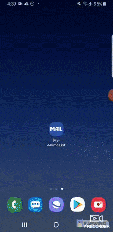

# MyAnimeList
An Android app using the MyAnimeList open API. Created using Android Studio.

## Features:
- Login with OAuth and your MAL account
- Can view your watchlists (plan to watch, completed, watching)
- Search for anime by name
- Add anime to one of your lists, or remove
- Generate random anime to watch next from your plan to watch list as a suggestion

## Stuff I learned:
- Retrofit to make API calls
- OAuth authentication flow and async calls with Retrofit
- Java object modelling based on JSON response body
- UI design elements like spinners and visibility, custom backgrounds for items and spinner items
- RecyclerView and adapters for lists
- Logout dialog
- Sharedpreferences to store auth token
- Destroying/creating activities to prevent accessing login screen if already logged in

## Demo:

[Check out a demo of the app](https://youtu.be/4b4xoXyjNXk)

## Download:
[Download here](https://drive.google.com/file/d/1zYAx0757lg59JwdW4HS1gQlxXIx2rhZb/view?usp=sharing)
